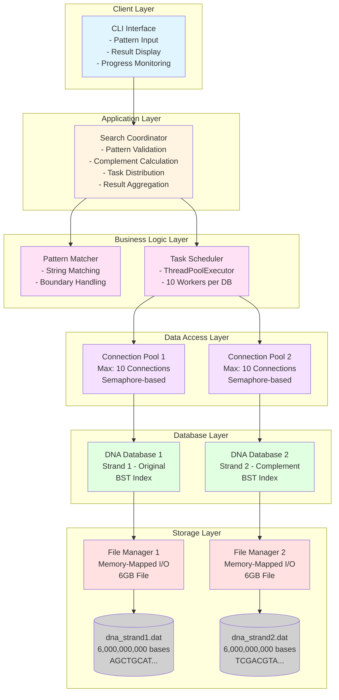

## 1. High-Level System Architecture

```mermaid
graph TB
    subgraph "Client Layer"
        CLI[CLI Interface<br/>- Pattern Input<br/>- Result Display<br/>- Progress Monitoring]
    end
    
    subgraph "Application Layer"
        SC[Search Coordinator<br/>- Pattern Validation<br/>- Complement Calculation<br/>- Task Distribution<br/>- Result Aggregation]
    end
    
    subgraph "Business Logic Layer"
        PM[Pattern Matcher<br/>- String Matching<br/>- Boundary Handling]
        TS[Task Scheduler<br/>- ThreadPoolExecutor<br/>- 10 Workers per DB]
    end
    
    subgraph "Data Access Layer"
        CP1[Connection Pool 1<br/>Max: 10 Connections<br/>Semaphore-based]
        CP2[Connection Pool 2<br/>Max: 10 Connections<br/>Semaphore-based]
    end
    
    subgraph "Database Layer"
        DB1[DNA Database 1<br/>Strand 1 - Original<br/>BST Index]
        DB2[DNA Database 2<br/>Strand 2 - Complement<br/>BST Index]
    end
    
    subgraph "Storage Layer"
        FM1[File Manager 1<br/>Memory-Mapped I/O<br/>6GB File]
        FM2[File Manager 2<br/>Memory-Mapped I/O<br/>6GB File]
        
        F1[(dna_strand1.dat<br/>6,000,000,000 bases<br/>AGCTGCAT...)]
        F2[(dna_strand2.dat<br/>6,000,000,000 bases<br/>TCGACGTA...)]
    end
    
    CLI --> SC
    SC --> PM
    SC --> TS
    
    TS --> CP1
    TS --> CP2
    
    CP1 --> DB1
    CP2 --> DB2
    
    DB1 --> FM1
    DB2 --> FM2
    
    FM1 --> F1
    FM2 --> F2
    
    style CLI fill:#e1f5ff
    style SC fill:#fff4e1
    style PM fill:#ffe1f5
    style TS fill:#ffe1f5
    style CP1 fill:#f5e1ff
    style CP2 fill:#f5e1ff
    style DB1 fill:#e1ffe1
    style DB2 fill:#e1ffe1
    style FM1 fill:#ffe1e1
    style FM2 fill:#ffe1e1
    style F1 fill:#d0d0d0
    style F2 fill:#d0d0d0
```